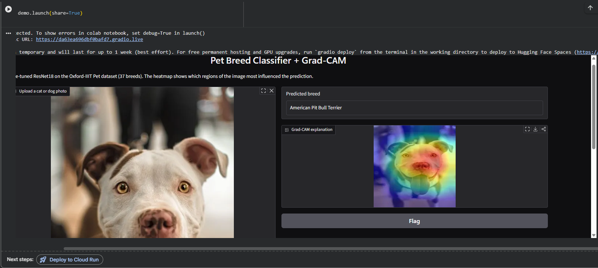
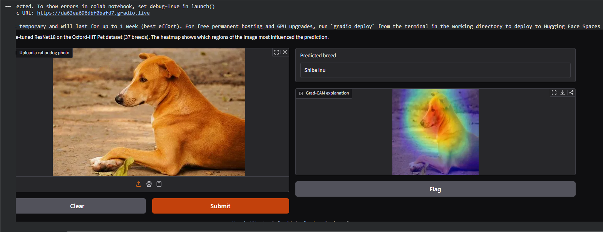

# Pet Breed Classifier with Grad-CAM Explainability

A deep learning project that fine-tunes a pretrained ResNet18 to classify 37 cat/dog breeds from the Oxford-IIIT Pet dataset, and uses **Grad-CAM** to visually explain which parts of each image the model used to make its decision.

## Results

- **Final test accuracy: 88.1%** after 8 epochs of training
- Training completed in ~4.6 minutes on a Colab T4 GPU

| Epoch | Train Acc | Test Acc |
|---|---|---|
| 1 | 63.9% | 84.2% |
| 4 | 98.6% | 88.2% |
| 8 | 99.9% | 88.1% |

(Full training log in `training_log.png`)

## Approach

**Transfer learning:** rather than training a CNN from scratch, this project starts from a ResNet18 pretrained on ImageNet (1.4M images) and fine-tunes only the last convolutional block (`layer4`) plus a new classifier head for the 37 pet breeds. This is standard practice for real-world vision tasks with limited data/time.

**Explainability with Grad-CAM:** after each prediction, Grad-CAM traces gradients back to the last convolutional layer to produce a heatmap showing which image regions most influenced the decision — turning the model from a black box into something interpretable.

## Files

- `pet_breed_classifier_gradcam.ipynb` — full notebook (data loading, training, Grad-CAM implementation, Gradio demo)
- `training_log.png` — per-epoch training/test loss and accuracy
- `training_curves.png` — loss/accuracy plots over training
- `gradcam_grid.png` — Grad-CAM visualizations across 6 test images
- `demo_example_1.png`, `demo_example_2.png` — live demo screenshots

## Example Results

**Correct prediction** — American Pit Bull Terrier, with the heatmap correctly focused on facial features:

**Misclassification** — a mixed-breed/street dog predicted as "Shiba Inu." A useful limitation to note: the model was trained on curated purebred photos, so unusual poses or non-purebred dogs can still be confidently misclassified based on coloring/build similarity.

## How to run

Open `pet_breed_classifier_gradcam.ipynb` in [Google Colab](https://colab.research.google.com), set Runtime → GPU, and run all cells. See the notebook's own setup section for details.

## Limitations

- Fine-grained breed classification is genuinely hard — some breeds look visually very similar even to humans.
- Grad-CAM heatmaps approximate what the network attended to; they aren't a literal readout of its internal reasoning.
